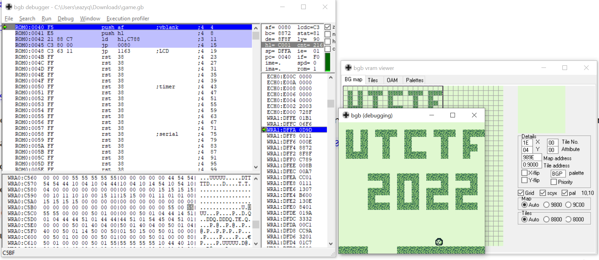

# Adventure ROM 4

[[+] Source](https://github.com/0ni0n-team/CTF-writeups/blob/main/utctf/re/Adventure%20ROM%204/game.gb)

### First sight

We got a .gb binary, load it to bgb

After playing around for a while, i finally get to this round

This big wall is kinda sus to me, let's try to get to the other side by removing blocks

### Debug

By open the VRAM viewer, we can see the `Map address` for each tile

Here we can see the flag tile is at address `99EB`

So `flag` = 02, `brick` = 01

I tried to change the value of those brick to 00 and got this

It dissapear !!! But the player still can't go through

So these address's value must be used for drawing purpose only and the blocks are still there

If we want to actually remove the blocks we have to find what have wrote to these address by placing access breakpoints to address

Let's go back a level and see what's happen

Breakpoint hits at `ROM0:1598`

Here the value in `hl` is what interest me

Get to `C1CC` offset

The block's value must be in this offset, `00` here is no block

Again set write breakpoints to this address

These piece of code is interesting, it get data from a table, do some right shift and the result is a block's value range between 0 and 2

We just have to find that table and change all the value to `00` cuz `00` go through those algo will always be `00`

Here we notice `C1CE` = `C5` and `C1CD` = `B8`

By reverse the code we got `C5B8` is one of an address in that table

Those sequence of `0x55` bytes is so fishy, maybe the road?

They are the road's blocks

So we just have to change almost every bytes except these `0x55` to go to another side

Then we got the flag

